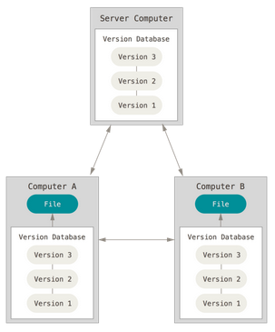
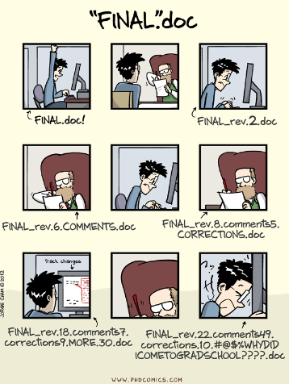

# Review of the pre-recorded lecture

**Outline**
- [Review of the pre-recorded lecture](#review-of-the-pre-recorded-lecture)
  - [What is distributed version control?](#what-is-distributed-version-control)
  - [Why is Git useful?](#why-is-git-useful)
  - [Track your own work with Git](#track-your-own-work-with-git)
  - [Share your work and collaborate on GitHub](#share-your-work-and-collaborate-on-github)
  - [Final tips](#final-tips)
  - [Workflow figure](#workflow-figure)

-------------

## What is distributed version control?
- Each client mirrors the entire repository and its history. 

- Git is one type of distributed verion control

-------------

## Why is Git useful?
- History: git was created for a HUGE software project, so it’s very efficient, but you won’t need all its features

- The user experience is more intuitive. You interact with the system like git stores a stream of snapshots instead of just differences between files. 

- It is highly reliable. It converts the contents of a file or directory into a hash. This hash consists of 40 hexidecimal characters. It is unique and deterministic, so if you change the contents of a file, the hash will change. 

- Most developers use git for version control

- In research, we should aspire to "distributed, open-source knowledge development" (McElreath, 2020). For this, we need a reliable and efficient verison control system. We want to avoid the kind of situation in the comic below:
 

------------

## Track your own work with Git
- How to get help (git help, man git)
  - `git help <verb>` - In the terminal (if you know the verb and want to know what it does or what are its options) 
  - Google your question

- 3 file states and parts of a git repo
  1. Files in the "modified" state are in the "working directory"
  2. Files in the "staged" state are in the "Stagining area" (aka the "Index")
  3. The snapshots of files in the "commmited" state are in the "Local repository"

- 3-step basic workflow
  1. Modify a file
   
  2. Stage your changes with `git add <file>`
  

  3. Take a snapshot of your staged changes with `git commit -m "short, informative commit message"` 

- Starting a local git repo
  - Turn an existing folder into a git repository with `git init` 
  - Download a remote repository onto your computer with `git clone <remote address>`  

- Inspecting (useful commands that don't *do* anything)
  - Check the status of files in your repo with `git status`  
  - See what changed with `git diff`  
  - See the history of your repo with `git log`  

- Undoing things
  - Unmodify a file with `git restore <file>` or  `git checkout -- <file>`
  - Unstage a file with `git restore --staged <file>`  or  `git reset HEAD <file>`
  - Add changes you forgot in the last commit with `git add <file>` then `git commit --amend`
  - Undo the last commit with `git reset HEAD~`

- Branches (git branch, git checkout)
  - Branches allow for nonlinear development (changes happening in parallel, sometimes by different people)
  - A branch marks a line of development. Git records this as a text file, where the file name is the branch name, and the file contains the commit hash for the latest commit in that branch.
  - A tag marks an important point in history (e.g., software version). Git records this as a text file, where the file name is the tag name, and the file contains the commit hash for the commit when the tag was created. It always stays with the same commit. 
  - See which branch you’re on with `git branch`
  - Start a new branch with `git branch <branch name>`
  - Change branches with `git checkout <branch name>`
  - Merge a branch into your current branch with `git merge <branch name>`
  

-------------

## Share your work and collaborate on GitHub
- Remotes
  - A remote repository can be online on a website like GitHub, BitBucket, or GitLab. It can also be on another computer that's connected by a server. 
  - Show your remote repos with `git remote -v`
  - Add a remote repo with `git remote add <remote name> <remote address>`
  - Push commits to a remote repo with `git push <remote name> <branch>`
  - Fetch commits from a remote repo with `git fetch <remote name>`
  - Merge fetched commits from a remote repo with `git merge <remote name>/<branch>`

- Forking
  - If you want to collaborate on someone else's repository, make a "fork" of that repo onto your GitHub account, and then clone and work on your fork. A fork is like a copy. 

- Pull requests
  - Once you've forked a remote repo, made changes, added and committed those changes, and pushed your changes to your fork on GitHub, then you can open a pull request to ask the maintainers of the original repo if they want to integrate your changes. 
  - Then the project maintainers can review your code, make suggestions / edits, and decide whether to merge it into the original repository.
 
- GitHub issues
  - Issues can be used to report a problem, propose something new, or find something to work on. 

- Merge conflicts
  - A merge conflict occurs if two people edit the same entity, and git can't automatically merge the two changes. For example, this could happen if two people edit the same line of code. 
  - To fix a merge conflict, you need to manually integrate the two edits (e.g., by choosing which one to keep)
 

------

## Final tips
- Commands can become powerful with options. E.g., `git log --pretty=format:"%h - %an, %ar : %s" --graph`

- You can set aliases for commands you use a lot. E.g., run `git config --global alias.fancylog 'log --pretty=format:"%h - %an, %ar : %s" --graph'`, and then you can just run `git fancylog` to get the output of that long command.

----

## Workflow figure

